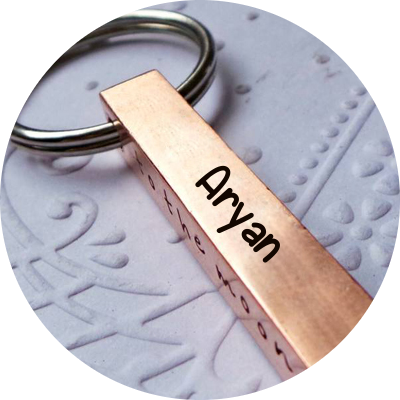

<!DOCTYPE html>
<html lang="en" dir="ltr">

<head>
  <meta charset="utf-8">
  <title>Aryan Grover</title>
  <link rel="stylesheet" href="css/master.css">
  <link rel="icon" href="images/save_aryan.png">
  <link rel="preconnect" href="https://fonts.googleapis.com">
  <link rel="preconnect" href="https://fonts.gstatic.com" crossorigin>
  <link href="https://fonts.googleapis.com/css2?family=Bree+Serif&family=Poppins:ital,wght@1,300&family=Sacramento&display=swap" rel="stylesheet">
</head>

<body class="whitep">
  

    
    <h1><strong>I'm Aryan</strong></h1>
    <h2>A coder/web developer</h2>
    
    
  

  

    

      
      <h2>Hello.</h2>
      
My name is Aryan and I am a python programmer and a web developer. I have created many websites using web development and I have also made many Python Programs like a model which predicts the house prices in boston and a barcode scanner. I continue to do my work and you can visit me on <a href="https://github.com/GitAryanCode">GitHub</a> at GitAryanCode.

    

    

    

      <h2>My Skills.</h2>
      

        
        <h3>Web Devolopment</h3>
        <h4>I started on Web Development in 2022 beacause my brother needed a website for his startup and his book, since then I thought I was doing web development for him but now that I am deep into it, it feels like I am doing it for myself, beacause I loved making functional websites.</h4>
      

      

        
        <h3>Python</h3>
        <h4>I started learning Python since I was 7 to be a Data Scientist conduducing model predections and figuring out which is a cat or which is a dog with Python. Today I use Python to make models like House Price Predicting and I conduct analysis on Datasets that are on Kaggle.</h4>
      

    

    

    

      <h2>Get In Touch</h2>
      <a class="btn" href="https://mail.google.com/mail/u/0/?fs=1&tf=cm&source=mailto&to=krishnagrover1000@gmail.com" target="_blank">Contact Me</a>
    

  

  

    <a class="footer-link" href="https://www.linkedin.com/in/aryan-grover-7603591ba/" target="_blank">LinkedIn</a>
    <a class="footer-link" href="https://twitter.com/AryanGrover20" target="_blank">Twitter</a>
    <a class="footer-link" href="https://gitaryancode.pythonanywhere.com/" target="_blank">Website</a>
    
© 2022 Aryan Grover

  

</body>

</html>
